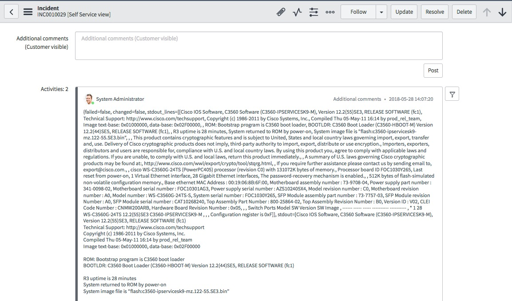
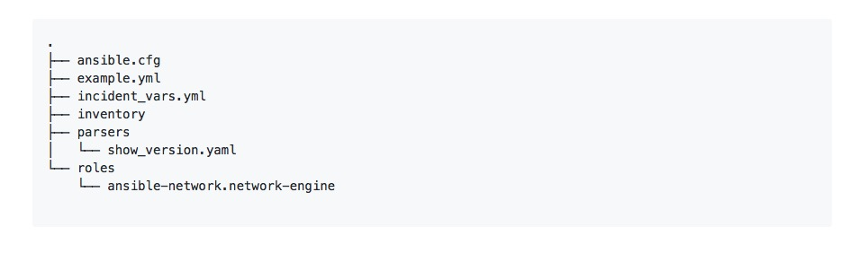
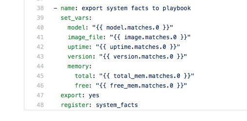
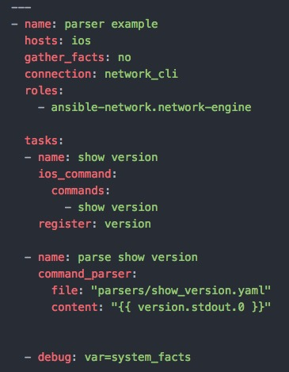
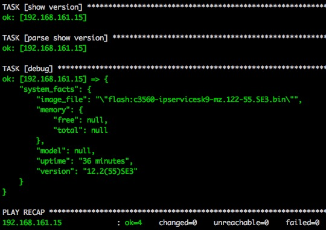
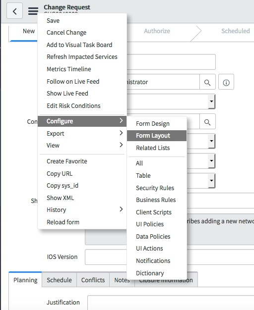
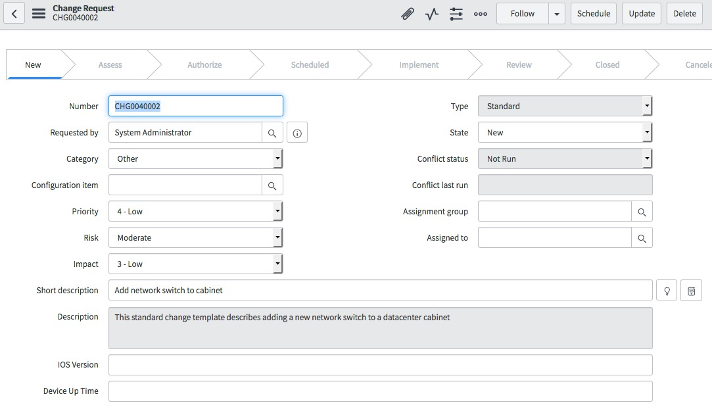
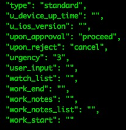
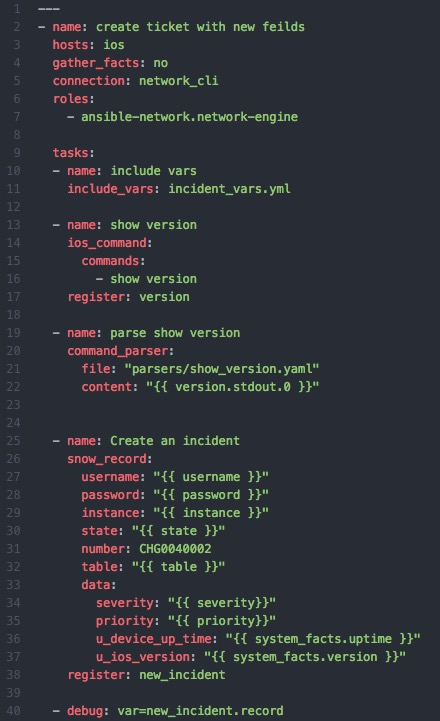
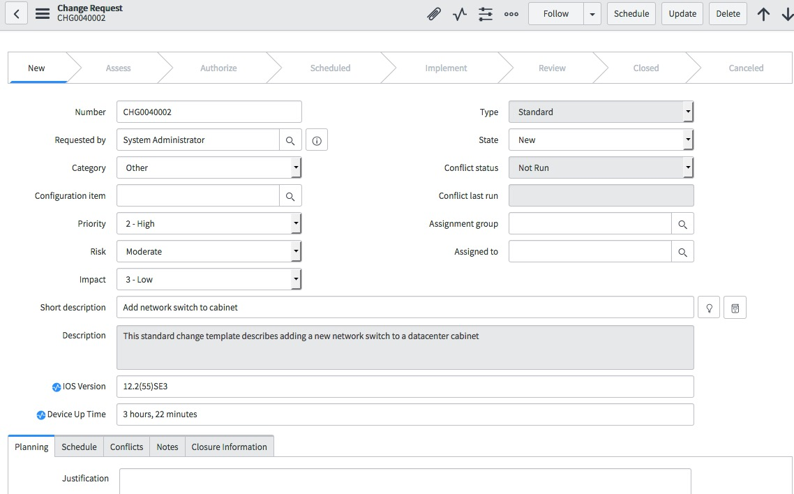

= {subject} [black]*Ansible For Network Engineers*
TheNetwork.Engineer
:subject:
:description:
:doctype: book
:confidentiality:
:listing-caption: Listing
:toc:
:toclevels: 6
:sectnums:
:chapter-label:
:icons: font
ifdef::backend-pdf[]
:pdf-page-size: A4
:source-highlighter: rouge
:rouge-style: github
endif::[]

|===

[red big]*Utilize Ansible for opening and closing tickets with ServiceNow - Part 3.*

Here are links to  https://www.thenetwork.engineer/blog/utilize-ansible-for-opening-and-closing-tickets-with-servicenow[Part 1]
or https://www.thenetwork.engineer/blog/utilize-ansible-for-opening-and-closing-tickets-with-servicenow-part2[Part 2]

This article is part three in a series covering the role Ansible can play in ticket automation.
This time we'll cover parsing the command output data your adding to your tickets.

In the last blog we had a lot of text from the show version command end up in our ticket.

We can filter this output and only record the specific data points we choose.
This can be done with the https://github.com/ansible-network/network-engine[ansible-network.network-engine] role and custom parsers.
In this blog we are going to use this specific parser https://github.com/ansible-network/network-engine/blob/devel/tests/text_parser/text_parser/parser_templates/ios/show_version.yaml[show_version.yaml] from the network-engine github repo.

You will structure your repo like this

On line 48 of show_version.yaml you can find the name of the dictionary we need to use in our debug.

[black big]*example.yml*

The parser takes the command output and creates a dictionary. The data points you want to use later in your playbook, are now parameters of [red]#system_facts#.

What I would like to do is add some fields in the ServiceNow change_request template, then add the version and uptime to every change request Ansible creates.

In ServiceNow this is done under Configure > Form Layout.

You can see below that I have added two new fields [purple]#IOS Version# & [purple]#Device Up Time#.

If we take a look at a snippet of the record dictionary the ServiceNow API sends back, it now has the the two new fields.
[purple]#"u_device_up_time"# & [purple]#"u_ios_version"#

We can use these new fields in the [red]#data# section of our [red]#snow_record module#.
Here is a complete playbook that will run the show version command, parse the output and add the parameters into the new fields for us.

The new fields are now populated in our ServiceNow change request.

[black big]*If you're interested in learning more, stay tuned for Part 4 of this series. We will continue to build a framework for fully automating our network tickets.*

|===
|===

|===

|===
TheNetwork.Engineer - July 8 2018  -  Colin McCarthy
|===
