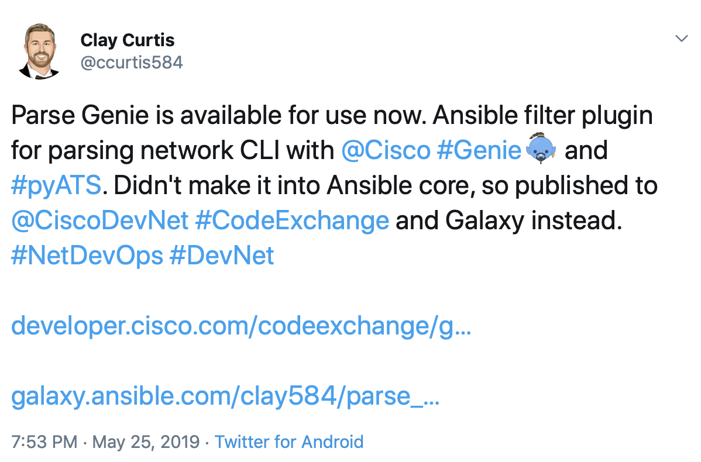
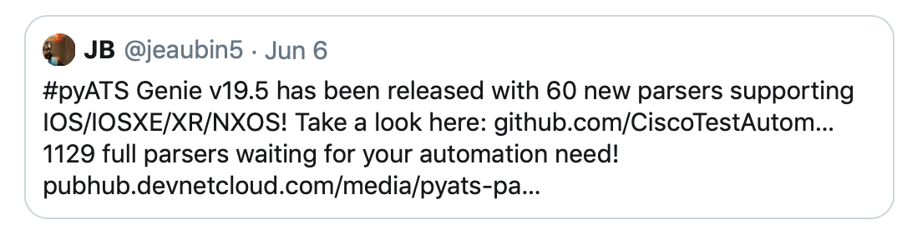
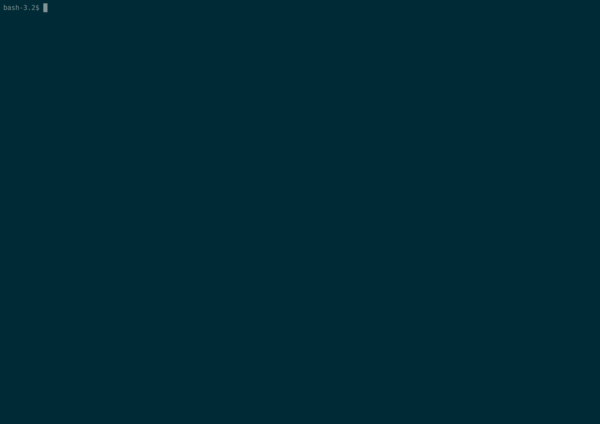

= {subject} [black]*Ansible For Network Engineers*
TheNetwork.Engineer
:subject:
:description:
:doctype:
:confidentiality:
:listing-caption: Listing
:toc:
:toclevels: 6
:sectnums:
:chapter-label:
:icons: font
ifdef::backend-pdf[]
:pdf-page-size: A4
:source-highlighter: rouge
:rouge-style: github
endif::[]

[red big]*Using pyATS and Genie with Ansible*

[black big]*pyATS and Genie*

Cisco has released two Python3 packages that are very useful for network automation - pyATS & Genie. The first one, pyATS functions as a framework while Genie builds on top of it. Genie can be used to parse, learn, and diff.
This blog will cover using the parsers that are made available in the Genie package. We will do this by calling a Galaxy role in our playbook named parse_genie.

This role was created by Clay Curtis @ccurtis584 and can be
found https://galaxy.ansible.com/clay584/parse_genie[here] on Galaxy.

Cisco is activley releasing new versions of the Genie package with more and more parsers.

Here is a list of the current parsers available in Genie...

https://pubhub.devnetcloud.com/media/pyats-packages/docs/genie/genie_libs/#/parsers

[black big]*Using the parse_genie filter plugin*

Let me show you my idea of how this role would be used.

We need to invoke the role at the beginning of the playbook so we
can use the filter plugin in a later task.

Don't forget to check out the dependencies...
This plugin will require Python 3.4+ and you need to pip install the pyATS and Genie packages as well.

With our first task we execute a show version command and register the output to a variable.

Next we filter the text obtained via our show command through the parse_genie filter plugin, we now have structured data in JSON format.
We can programmatically use our parsed data very easily when it's structured like this.
As an example I am debug-ing single facts like version and uptime.

[source,yaml]
----
---
- name: pyATS testing
  hosts: ios
  gather_facts: no
  connection: network_cli
  roles:
    - parse_genie

  tasks:

  - name: Run the show version command
    ios_command:
      commands:
        - show version
    register: version

  - name: Set fact with Genie filter plugin
    set_fact:
      pyats_version: "{{ version['stdout'][0] | parse_genie(command='show version', os='ios') }}"

  - name: Debug pyATS facts - all
    debug:
     var: pyats_version.version

  - name: Debug pyATS facts - version
    debug:
     var: pyats_version.version.version

  - name: Debug pyATS facts - uptime
    debug:
     var: pyats_version.version.uptime
----

[black big]*Final thoughts*

I am pretty excited to have access to all of these pre-written parsers in Ansible now.
The Genie parsers use OS-agnostic data models. As this project continues to grow and folks contribute
parsers for other vendors we should not have to adjust our playbooks.

You may consider replacing the [red]#ios# in the filter plugin to use [red]#ansible_network_os# variable that was introduced with
the network_cli connection plugin. That way you could run against nxos, ios, junos, etc.. all in the same inventory and playbook run.

[black big]*Stay tuned for more blogs*

|===
|===

|===

|===
TheNetwork.Engineer - June 16 2019  -  Colin McCarthy
|===
