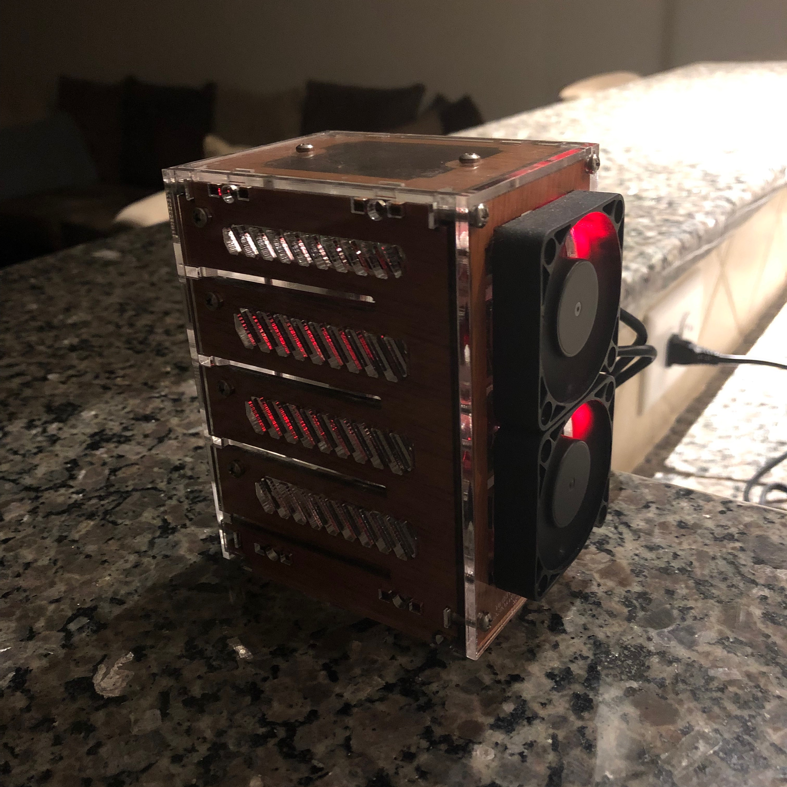
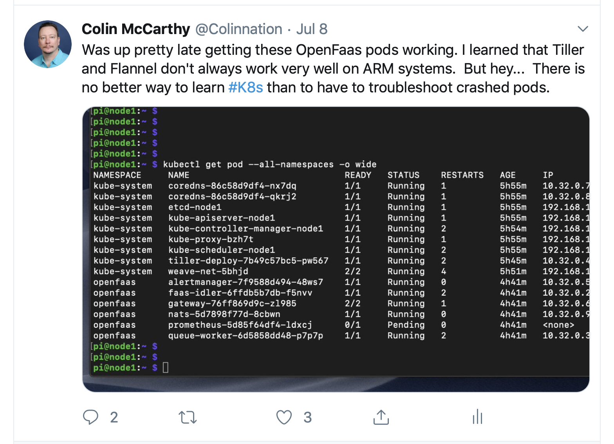
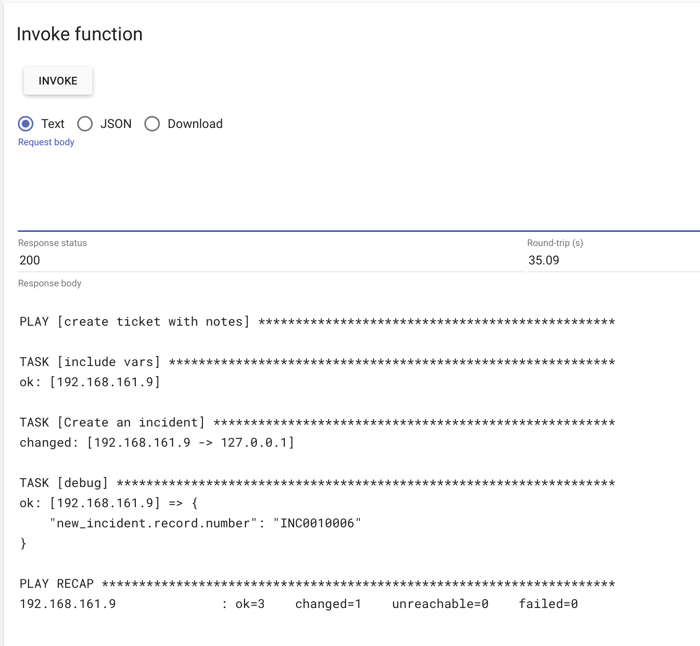
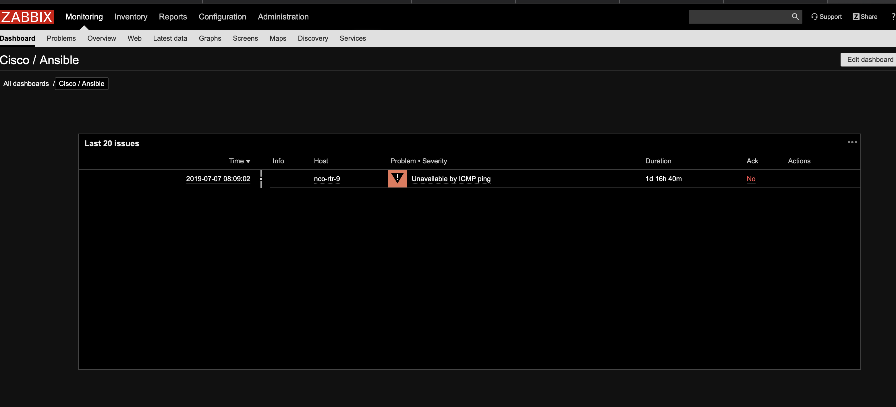
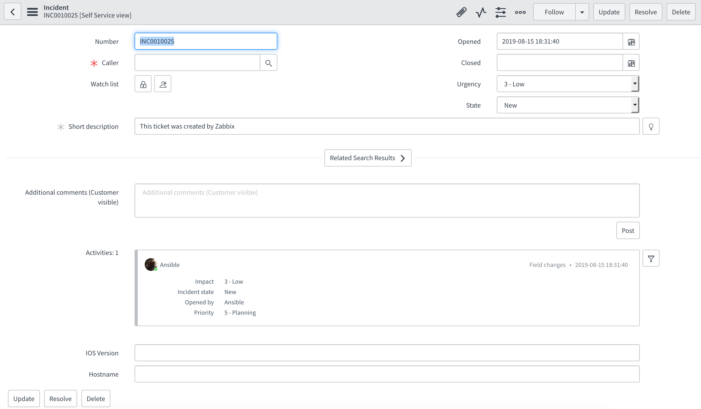
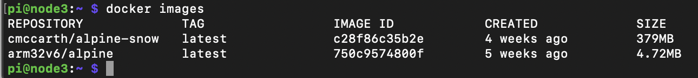

= {subject} [black]*Ansible Functions as a Service for Network Automation*
TheNetwork.Engineer
:subject:
:description:
:doctype:
:confidentiality:
:listing-caption: Listing
:toc:
:toclevels: 6
:sectnums:
:chapter-label:
:icons: font
ifdef::backend-pdf[]
:pdf-page-size: A4
:source-highlighter: rouge
:rouge-style: github
endif::[]

[black big]*OpenFaaS*

I built a Raspberry Pi cluster and decided to look into getting OpenFaaS
running on it.

OpenFaaS let's you build and deploy server-less functions, which I think of as small containers that can scale to zero.
They have a listener that is on standby ready for you to trigger the function via the API or from the OpenFaaS GUI.

I made the decision to also stand up a Kubernetes cluster for OpenFaaS to run on.

[red]#*If I was starting over I would stand up K3s by Rancher Labs, not the full Kubernetes install.#

If your interested in going that route there is a new blog that Alex Ellis has written for using [red]#K3s# that can be
found https://blog.alexellis.io/test-drive-k3s-on-raspberry-pi/[here].

After I got Kubernetes working and got OpenFaaS stood up I decided to create a function that would use Ansible to open a ServiceNow ticket.
I tried a few different ways including a [red]#Python3 template# and then eventually settled on using a [red]#Dockerfile template#.
The Dockerfile I used is below. Now I'm also sourcing the container from a custom Docker image that I made named [red]#alpine-snow#
which has Ansible and the [red]#pysnow# Python library installed.

[black big]*The Ticketing Function That I built*

[source,yaml]
----
FROM openfaas/classic-watchdog:0.13.4 as watchdog

FROM cmccarth/alpine-snow:latest

USER root

RUN mkdir -p /app

COPY --from=watchdog /fwatchdog /usr/bin/fwatchdog
RUN chmod +x /usr/bin/fwatchdog

# Add SNOW ENV vars
ENV SN_USERNAME "admin"
ENV SN_PASSWORD "omitted"
ENV SN_INSTANCE "omitted"

# Add non root user
RUN addgroup -S app && adduser app -S -G app
RUN chown app /home/app

WORKDIR /home/app

USER app

RUN git clone https://github.com/colin-mccarthy/env_vars
WORKDIR /home/app/env_vars

ENV fprocess="ansible-playbook create_ticket.yml -i hosts"

# Set to true to see request in function logs
ENV write_debug="false"

EXPOSE 8080
EXPOSE 31112
EXPOSE 22

HEALTHCHECK --interval=3s CMD [ -e /tmp/.lock ] || exit 1

CMD ["fwatchdog"]

ENV read_timeout="120"
ENV write_timeout="120"
----

[red]#*The Ansible module being used is a fun project myself and a friend Luke Short worked on a while back to add the ability to use
ENV vars with the snow_record module.#

It can be found https://github.com/colin-mccarthy/env_vars[here] on GitHub.

[black big]*The OpenFaaS GUI*

Here you can see a successful execution of my function from the OpenFaaS GUI.

[black big]*Automation*

Once I tested my function in the OpenFaaS GUI and saw that it was working it was time to automate the ticket creation.
I stood up Zabbix an open source network monitoring tool in a Docker container and built a trigger and an action. The trigger is setup to alarm if my Cisco 3560 switch
reboots. The action will curl the OpenFaaS function running on my Raspberry Pi cluster and should use Ansible to create a ticket in my free ServiceNow developers instance.

This was fairly easy as I just added a curl command to the Zabbix alarm [red]#curl http:/ /192.168.161.101:31112/function/ticket-function#
This worked fine to prove out my minimal solution but I plan to take it further and add the host into the curl when I revisit this project.
That way the ticket can include some device specific info and probably use some of the pyATS playbooks I have blogged about before to gather facts.
That may be better for other types of alarms where the device doesn't lose connectivity.

[black big]*Final thoughts*

You can see the size of my alpine-snow container compared to a typical alpine container. I think it would be fun to try and see how small I could get this and still have it function.
I have considered creating a smaller version of Ansible by removing all of the modules in the Library directory.
As well as any other plugins and what not that I'm not going to be using.
It's funny because while I was working on this Ansible announced a move to using collections, which sort of aligns with what I was thinking about.
Remove a number of the modules for the main Ansible package and have people only install the collections they want.

[black big]*Stay tuned for more blogs*

|===
|===

|===

|===
TheNetwork.Engineer - Aug 15 2019  -  Colin McCarthy
|===
