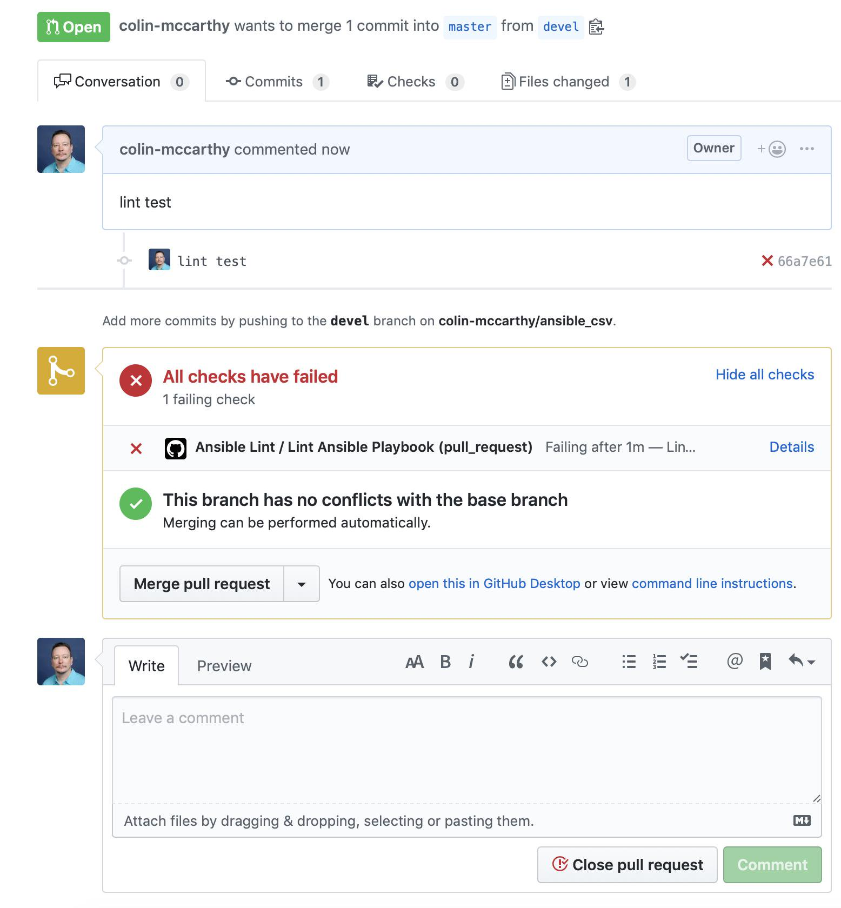
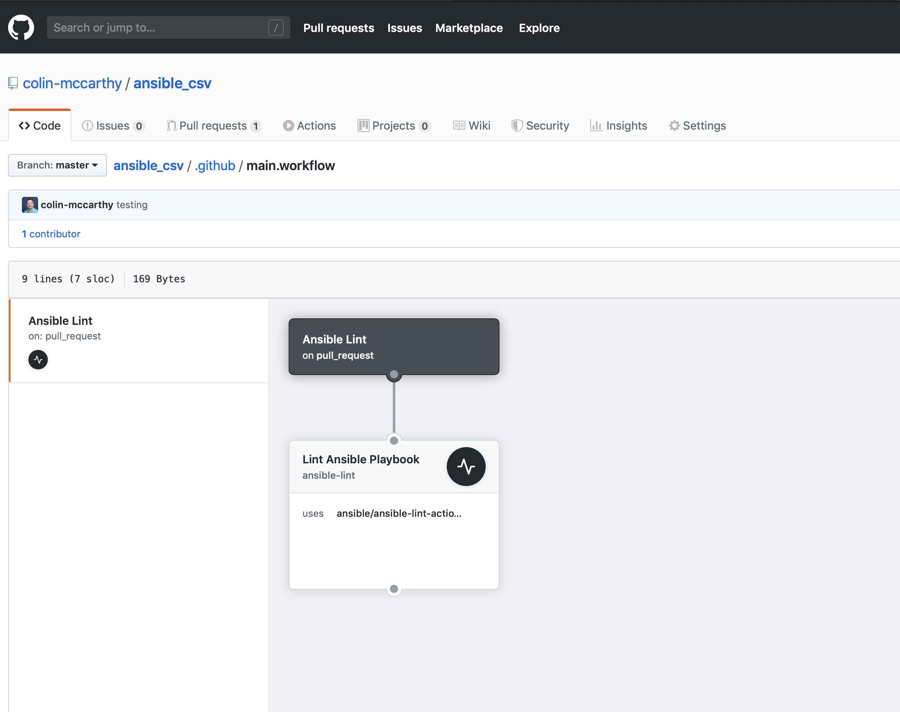
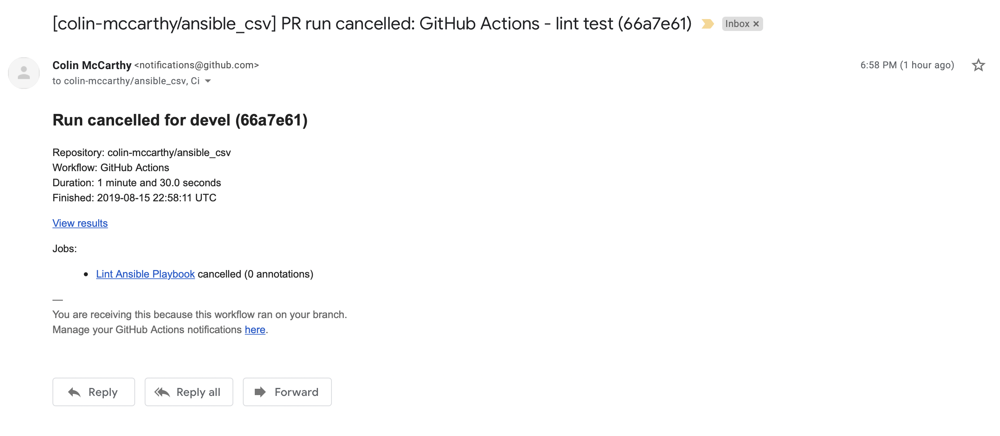

= {subject} [black]*Ansible Linting with GitHub Actions*
TheNetwork.Engineer
:subject:
:description:
:doctype:
:confidentiality:
:listing-caption: Listing
:toc:
:toclevels: 6
:sectnums:
:chapter-label:
:icons: font
ifdef::backend-pdf[]
:pdf-page-size: A4
:source-highlighter: rouge
:rouge-style: github
endif::[]


[black big]*Ansible-lint*

Ansible-lint is an open-source project that lints your Ansible code. The Docs state
that it checks playbooks for practices and behavior that could potentially be improved.
It can be installed with pip and run manually on single playbooks or set up in a pre-commit hook and ran when you attempt a
commit on your repo from the CLI.


The project can be found under the Ansible org on GitHub.

https://github.com/ansible/ansible-lint


[black big]*GitHub Actions*

GitHub Market place

Github actions recently came out. I was using Ansible-lint to lint my playbooks.

https://github.com/marketplace/actions/ansible-lint


[red]#*The Ansible module being used is a fun project myself and a friend Luke Short worked on a while back to add the ability to use
ENV vars with the snow_record module.#





[black big]*The action code*

```
workflow "Ansible Lint" {
 on = "pull_request"
 resolves = ["Lint Ansible Playbook"]
}

action "Lint Ansible Playbook" {
  uses = "ansible/ansible-lint-action@v4.1.0"
}
```


[black big]*Automation*





I received an email notification as well




[black big]*Pre Commit hooks*


https://pre-commit.com

```
pip install pre-commit
```

make sure you...
```
pre-commit install
```

[black big]*Final thoughts*


This is a great way to get started with CI if you are using GitHub as your flavor of SCM.


[black big]*Stay tuned for more blogs*


|===
|===


|===

|===
TheNetwork.Engineer - SEP 29 2019  -  Colin McCarthy
|===
