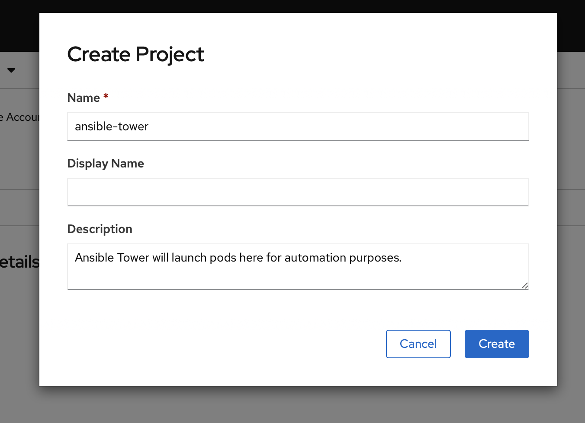
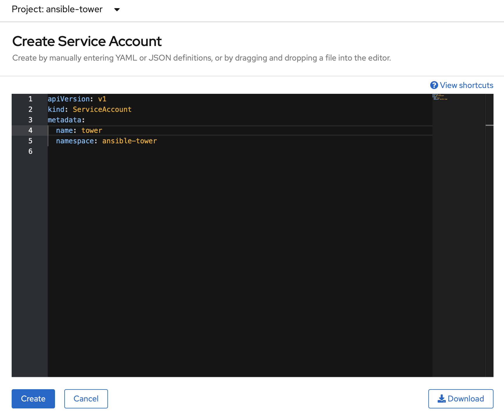
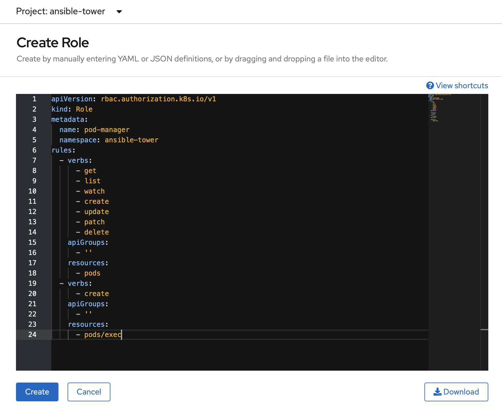
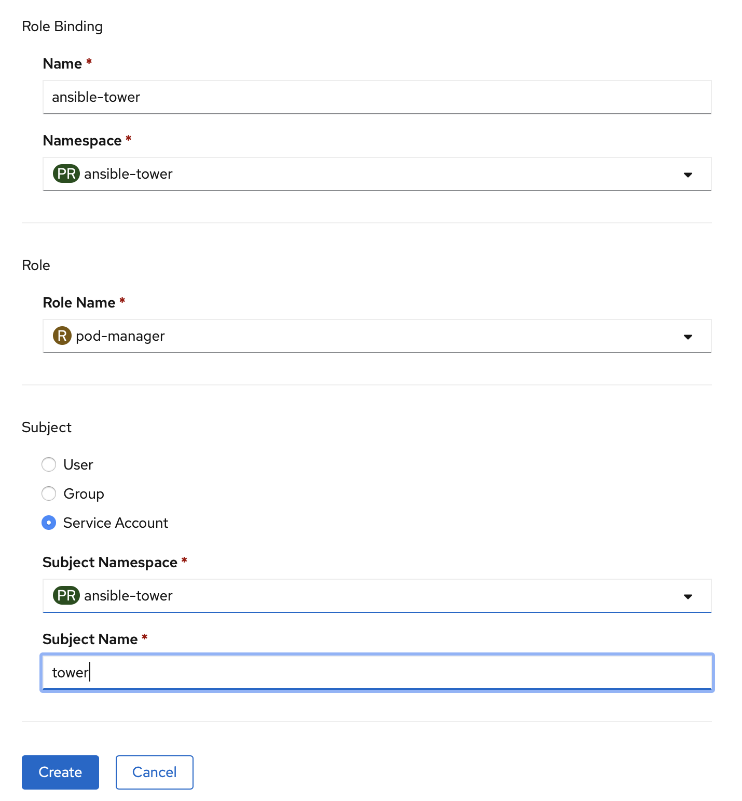
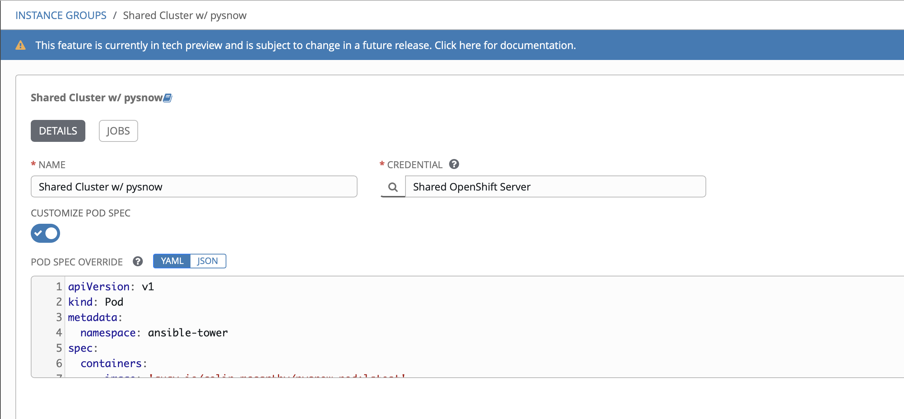

= {subject} [black]*Ansible Container Groups*
TheNetwork.Engineer
:subject:
:description:
:doctype:
:confidentiality:
:listing-caption: Listing
:toc:
:toclevels: 6
:sectnums:
:chapter-label:
:icons: font
ifdef::backend-pdf[]
:pdf-page-size: A4
:source-highlighter: rouge
:rouge-style: github
endif::[]


[red]*Ansible Tower Container groups*

What are they?
Serverless functions, Tower feature that runs a playbook on OpenShift/Kubernetes.


[red]*Ansible Runner*

The project can be found under the Ansible org on GitHub.

https://github.com/ansible/ansible-runner


[red]*OpenShift Steps*

[black]*1. Create a Project/Namespace in OpenShift named (ansible-tower).*



[black]*2. Create a ServiceAccount named (tower).*



[black]*3. Create a Role named (pod-manager).*

```
kind: Role
metadata:
  name: pod-manager
  namespace: ansible-tower
rules:
  - verbs:
      - get
      - list
      - watch
      - create
      - update
      - patch
      - delete
    apiGroups:
      - ''
    resources:
      - pods
  - verbs:
      - create
    apiGroups:
      - ''
    resources:
      - pods/exec
```



[black]*4. Create a RoleBinding* that binds the pod manager role to the tower service account.




[red]*Ansible Tower Steps*

Create the Credential

image:images/cred.png[640,480]


[black]*CREDENTIAL TYPE* == OpenShift or Kubernetes API Bearer Token


Copy stuff from the service account created in that project
(User Management > Service Accounts > The one you made in the earlier steps)


[black]*OPENSHIFT OR KUBERNETES API ENDPOINT*(short version from oc login with https://api.foo.openshift.io:6443)


[black]*API AUTHENTICATION BEARER TOKEN* (can be used by itself without cert auth data, you don't need both)

[black]*CERTIFICATE AUTHORITY DATA*

[red]*Create the Container Group*

In Ansible Tower under Instance Groups > The green plus symbol > CREATE CONTAINER GROUP

image:images/instance-group.png[640,480]

[red]*Configure the Container Group*

Give it a name and select the OpenShift or Kubernetes API Bearer Token we created earlier in the steps above.



Now the fun part, paste in your Kubernetes Pod manifest. I like to use this one as a default when first getting started.

[black]*Pod manifest*

```
apiVersion: v1
kind: Pod
metadata:
  namespace: ansible-tower
spec:
  containers:
    - image: 'registry.redhat.io/ansible-tower-37/ansible-runner-rhel7'
      tty: true
      stdin: true
      imagePullPolicy: IfNotPresent
      args:
        - sleep
        - infinity
```

[red]*What about module dependencies?*

Make your own container images! Start by creating a base Ansible Runner image in Quay.
This way you control the software delivery supply chain.

[black]*Ansible Runner*

https://quay.io/repository/colin_mccarthy/ansible-runner

Built by cloning ansible runner repo and then building from
https://github.com/ansible/ansible-runner/blob/devel/Dockerfile.dev[Dockerfile.dev]


[black]*Runner with pysnow package installed*

https://quay.io/repository/colin_mccarthy/pysnow_pod


[black]*Dockerfile*
```
FROM quay.io/colin_mccarthy/ansible-runner:stable_1.4.x

# dependencies
RUN pip3 install --no-cache-dir pysnow

# required
CMD ["ansible-runner", "run", "/runner"]
```


[red]*Quay/Clair*

Red Hat Quay - Container image registry

https://quay.io


Clair - Scanner

image:images/quay.jpeg[640,480]


[red]*Final thoughts*


This is a great way to get started with...


|===
|===


|===

|===
TheNetwork.Engineer - July 26 2020  -  Colin McCarthy
|===
