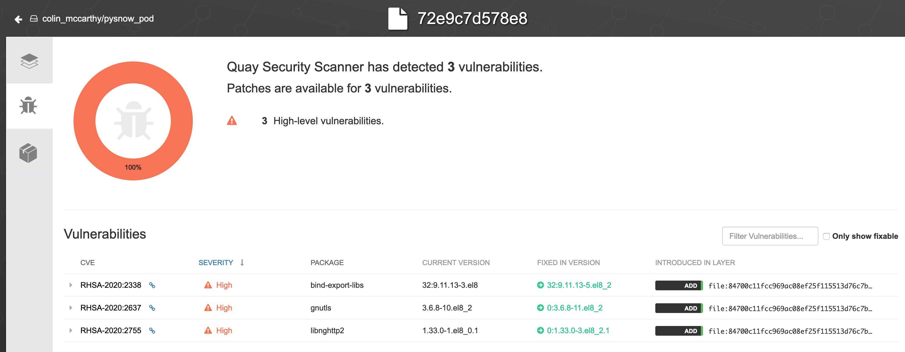

= {subject} [black]*Ansible Container Groups*
TheNetwork.Engineer
:subject:
:description:
:doctype:
:confidentiality:
:listing-caption: Listing
:toc:
:toclevels: 6
:sectnums:
:chapter-label:
:icons: font
ifdef::backend-pdf[]
:pdf-page-size: A4
:source-highlighter: rouge
:rouge-style: github
endif::[]


[red]*Ansible Tower Container groups*

What are they?
Serverless functions, Tower feature that runs a playbook on OpenShift/Kubernetes.


[red]*Ansible Runner*

The project can be found under the Ansible org on GitHub.

https://github.com/ansible/ansible-runner


[red]*OpenShift Steps*

Create a Project/NameSpace (ansible-tower)

image:images/cred.png[640,480]

Create a ServiceAccount

image:images/cred.png[640,480]

Create a Role (pod-manager)

image:images/cred.png[640,480]

Create a RoleBinding

image:images/cred.png[640,480]


[red]*Ansible Tower Steps*

Create the Credential

image:images/cred.png[640,480]


[black]*CREDENTIAL TYPE* == OpenShift or Kubernetes API Bearer Token


Copy stuff from the service account created in that project
(User Management > Service Accounts > The one you made in the earlier steps)


[black]*OPENSHIFT OR KUBERNETES API ENDPOINT*(short version from oc login with https://api.foo.openshift.io:6443)


[black]*API AUTHENTICATION BEARER TOKEN* (can be used by itself without cert auth data, you don't need both)

[black]*CERTIFICATE AUTHORITY DATA*

[red]*Create the Container Group*

add steps...

[black]*Pod manifest*

```
apiVersion: v1
kind: Pod
metadata:
  namespace: ansible-tower
spec:
  containers:
    - image: 'registry.redhat.io/ansible-tower-37/ansible-runner-rhel7'
      tty: true
      stdin: true
      imagePullPolicy: IfNotPresent
      args:
        - sleep
        - infinity
```

[red]*What about module dependencies?*

Make your own images:

[black]*Ansible Runner*

https://quay.io/repository/colin_mccarthy/ansible-runner

Built by cloning ansible runner repo and then building from Dockerfile.dev

https://github.com/ansible/ansible-runner/blob/devel/Dockerfile.dev


[black]*Runner with pysnow package installed*

https://quay.io/repository/colin_mccarthy/pysnow_pod


[black]*Dockerfile*
```
FROM quay.io/colin_mccarthy/ansible-runner:stable_1.4.x

# dependencies
RUN pip3 install --no-cache-dir pysnow

# required
CMD ["ansible-runner", "run", "/runner"]
```


[red]*Quay/Clair*

Red Hat Quay - Container image registry

https://quay.io


Clair - Scanner




[red]*Final thoughts*


This is a great way to get started with...


|===
|===


|===

|===
TheNetwork.Engineer - July 26 2020  -  Colin McCarthy
|===
