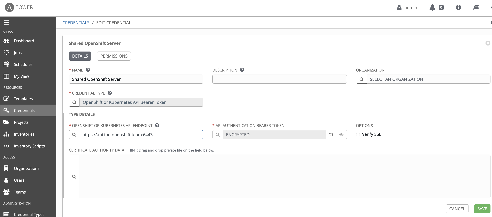
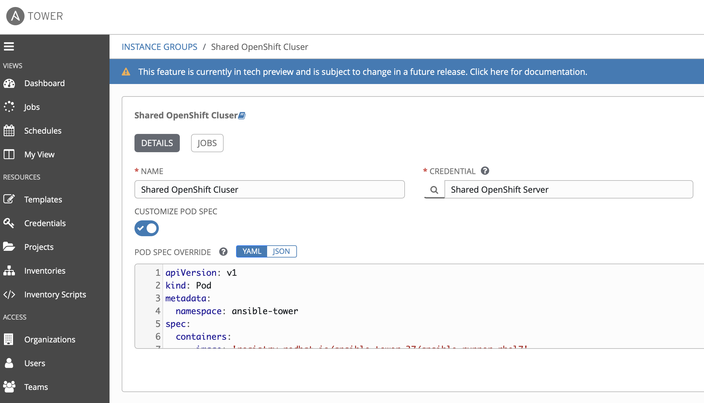

= {subject} [black]*Ansible Container Groups*
:subject:
:description:
:confidentiality:
:listing-caption: Listing
:toc:
:toclevels: 6
:sectnums:
:chapter-label:
:icons: font
ifdef::backend-pdf[]
:pdf-page-size: A4
:source-highlighter: rouge
:rouge-style: github
endif::[]

[big red]*Ansible Tower Container groups*

What are they? Serverless functions, a Tower feature,
 an integration to run your playbooks in OpenShift/Kubernetes pods.

<Video Here>

This is made possible by using Ansible Runner.

The project can be found under the Ansible org on GitHub.

https://github.com/ansible/ansible-runner

Below I will detail the steps required to set this up.

[big black]*OpenShift*

[black]*1. Create a Project/Namespace in OpenShift named (ansible-tower).*

[black]*2. Create a ServiceAccount named (tower).*

[black]*3. Create a Role named (pod-manager).*

[source,yaml]
----
---
kind: Role
metadata:
  name: pod-manager
  namespace: ansible-tower
rules:
  - verbs:
      - get
      - list
      - watch
      - create
      - update
      - patch
      - delete
    apiGroups:
      - ''
    resources:
      - pods
  - verbs:
      - create
    apiGroups:
      - ''
    resources:
      - pods/exec
---

image:images/role.png[]

[black]*4. Create a RoleBinding* that binds the pod manager role to the tower service account.

[big black]*Ansible Tower*

[big black]*1. Create the Credential*

[black]*CREDENTIAL TYPE*

Choose the  OpenShift or Kubernetes API Bearer Token type.

Copy the token from the service account created in that project
(User Management > Service Accounts > (tower) <-The one you made in the earlier steps)

[black]*OPENSHIFT OR KUBERNETES API ENDPOINT*

I grabbed the short version from the oc login command, it should look like (https://api.foo.openshift.io:6443)

[big black]*2. Create the Container Group*

In Ansible Tower under Instance Groups > The green plus symbol > CREATE CONTAINER GROUP

[big black]*3. Configure the Container Group*

Give it a name and select the OpenShift or Kubernetes API Bearer Token we created earlier in the steps above.

Now the fun part, paste in your Kubernetes Pod manifest. I like to use this one as a default when first getting started.

[black]*Pod manifest*

[source,yaml]
----
---
apiVersion: v1
kind: Pod
metadata:
  namespace: ansible-tower
spec:
  containers:
    - image: 'registry.redhat.io/ansible-tower-37/ansible-runner-rhel7'
      tty: true
      stdin: true
      imagePullPolicy: IfNotPresent
      args:
        - sleep
        - infinity
---

[black]*What about module dependencies?*

As we know in Ansible Tower we need to install our dependencies in custom virtual environments.
How can we accomplish this when using Container Groups?
Well, you can make your own container images with the dependencies already installed. Start by creating a base Ansible Runner image in Quay.
This way you control the software delivery supply chain. Mine is listed below.

https://quay.io/repository/colin_mccarthy/ansible-runner

I built this by cloning the Ansible Runner Github repo and then building from
https://github.com/ansible/ansible-runner/blob/devel/Dockerfile.dev[Dockerfile.dev]

[black]*Runner with pysnow package installed*

I then made a new https://quay.io/repository/colin_mccarthy/pysnow_pod[image], I went ahead and installed the dependency (pysnow)
via pip right in the Dockerfile.

[black]*Dockerfile*

[source,yaml]
----
---
FROM quay.io/colin_mccarthy/ansible-runner:stable_1.4.x

# dependencies
RUN pip3 install --no-cache-dir pysnow

# required
CMD ["ansible-runner", "run", "/runner"]
---

I built a new image in Quay based on this Dockerfile and now its ready to use
in my Pod manifest like this.

[source,yaml]
----
---
apiVersion: v1
kind: Pod
metadata:
  namespace: ansible-tower
spec:
  containers:
    - image: 'quay.io/colin_mccarthy/pysnow_pod:latest'
      tty: true
      stdin: true
      imagePullPolicy: Always
      args:
        - sleep
        - infinity
---

[big black]*Final thoughts*

This is a great way to get started with OpenShift if your coming from an Ansible background.
I suggest you look at Quay and build some images using the source from a Git repo option.
The GitOps and vulnerability scanning is really great.

[big red]*Quay/Clair*

Red Hat Quay - Container image registry

https://quay.io

Clair - Scanner

image:images/quay.jpeg[]

|===
|===

|===

|===
TheNetwork.Engineer - OCT 19 2020  -  Colin McCarthy
|===
